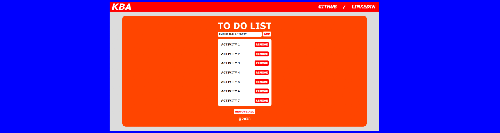
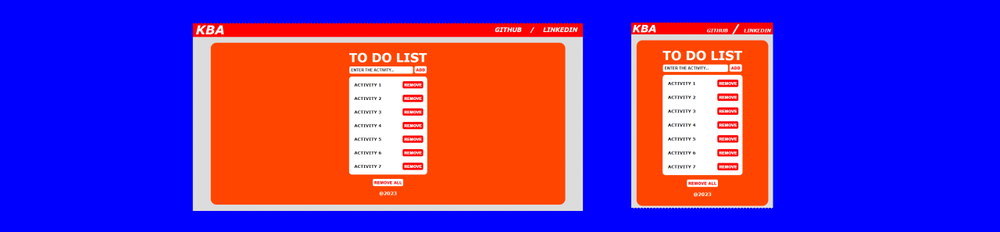

# **TO DO LIST**

## Sobre o projeto

Projeto: [trabalho de javascript](https://javascript-to-do-list-one.vercel.app/)

O usuário digita uma atividade, pressiona “Enter” ou clica em “Adicionar” para adicioná-la à lista. Caso não queira uma atividade, você pode removê-la ou até mesmo remover todas elas conforme desejar.

The user types an activity, presses "Enter" or clicks "Add" to add it to the list. If you don't want an activity, you can remove it or even remove all of them as you wish.

## Layout web e mobile 

## Tecnologias Utilizadas

* HTML 5
* CSS3 
* Javascript
    * Uso de DOM (DOM Usage)
    * Classe (Class)
    * Funções (Functions)
    * Evento (Event)
        * Click
        * Keypress

## Autor

#### **Katarine Albuquerque**

    
    &nbsp;
    

